# procedural-art

## Examples of procedural generative art and animations in python
#

# Install requirements
```
pip install -r requirements.txt
```

Perlin noise lib and animations can be found at:

https://github.com/timpyrkov/pythonperlin/

https://www.instagram.com/timpyrkov/


# Cloud texture

- To genrate cloud texture we use perlin noise with large number of octaves. Then colorize it using a white-blue colormap.

- Alternatively, we can colorize it with red-dark colormap to get a Babylon-5 hyperspace-looking texture.

```
from pythonperlin import perlin
import pylab as plt

p = perlin((3,3), dens=128, octaves=4)
plt.imshow(p, cmap="Blues")
```

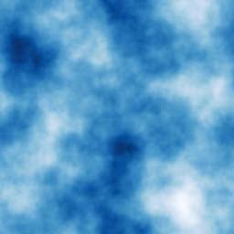
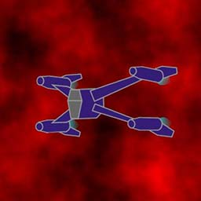

# Water caustics

- To generate water caustics we use absolute value of perlin noise (no octaves). Then contrast it with a logscale-sampled colormap.

```
logscale = np.logspace(0,-2,5)
colors = plt.cm.get_cmap("PuBuGn_r")(logscale)
cmap = LinearSegmentedColormap.from_list("caustics", colors)
```

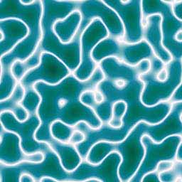

# Flow field

- To generate a flowfield we use Perlin noise (no octaves) as a vector field. Value at each grid node gives a direction vector (gradient). Then drop random dots and calculate how they move along the gradients. 

```
p = perlin((6,6), dens=24)
z = np.exp(2j * np.pi * p)
dx, dy = z.real, z.imag
x[k+1] = x[k] + dx
y[k+1] = y[k] + dy
```

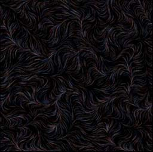

# Wireframe

- To generate a smoothly morphing wireframe we use Perlin noise (no octaves) to distort each grid node. Then populate the grid with more lines along one direction (x).

```
from pythonperlin import perlin, extend2d
p = perlin((6,6), dens=24)
z = np.exp(2j * np.pi * p)
dx, dy = z.real, z.imag
x = extend2d(x + dx, n=16, axis=1)
y = extend2d(y + dy, n=16, axis=1)
```

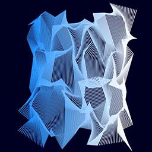

# Marble

- To model a marble texture we use perlin noise with large number of octaves. Then contrast it using a logscale-sampled colormap.

- Marble veins can be added using a periodic function sin(x).

```
from pythonperlin import perlin
p = perlin((4,4), dens=64, octaves=8, seed=0)

logscale = np.logspace(0,-10,50)
colors = plt.cm.get_cmap("BuPu")(logscale)
cmap = LinearSegmentedColormap.from_list("LightMarble", colors)
```

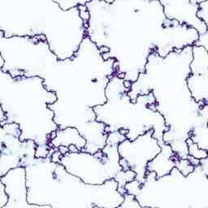
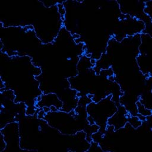
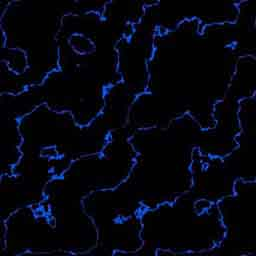

# Wood bark

- To model wood bark texture with fissuring pattern, we use combinations of Perlin noise with periodic colormap and stretching along the vertical direction.

```
from pythonperlin import perlin, extend2d
p = perlin((16,16), dens=16, octaves=8, seed=0)
p = extend2d(p0, n=4, axis=0, mode="same")

periodic = np.array([1, 0.1, 1, 0.1, 1, 0.1, 1])
colors = plt.cm.get_cmap("copper_r")(periodic)
cmap = LinearSegmentedColormap.from_list("wood", colors)
```

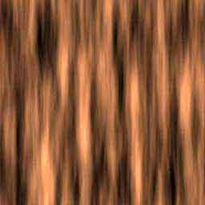
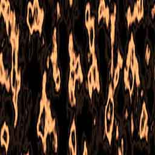
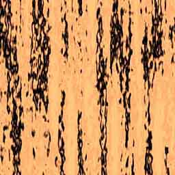


# Tree rings

- To model tree rings across the trunk, we use radial periodic function and distort the phase with Perlin noise.

- To model tree rings along the trunk, we scale up Perlin noise, say x 10 times, and subtract its integer part.

```
from pythonperlin import perlin, extend2d

""" Tree rings across the tree trunc. """
p = perlin((8,8), dens=32, octaves=2, seed=0)
idx = np.arange(len(p)) - len(p) / 2
x, y = np.meshgrid(idx, idx)
phi = np.sqrt(x**2 + y**2)
p = np.sin(0.3 * phi + 2 * p)

""" Tree rings along the tree trunk. """
p = 10 * perlin((4,4), dens=64, octaves=0, seed=0)
p = extend2d(np.abs(p), n=4, axis=0, mode="same")
p -= p.astype(int)
```

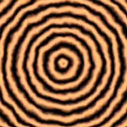
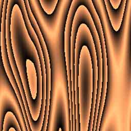

